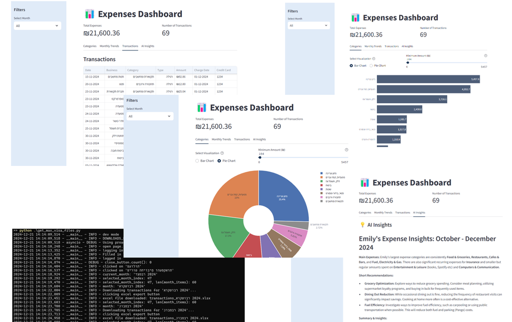

# Expenses Tracker

Easy-to-use credit expenses downloader, tracker and visualizer, with AI insights.




## Start

See instructions in the [Install](#install) section, and then:

```bash
python main.py
```

To run DEMO expenses data:

```bash
python main.py demo
```

⚠️ If you do not have software development knowledge OR if you are not aware of the benefits as well as dangers of using automations that are given permissions on your behalf - it is advised not to use this app. In any case, you must read the [Legal](#legal) section before using this software.
<br/>That said, there's a 99% (made up number) chance it's just fine, and I use it.

## Features

One-click to: 
- Download last quarter credit card expenses
- Visualize expenses by categories and months
- Get AI-powered insights

Less than 60 seconds to get a full picture of your expenses.

---

Automation:
- Download expenses data from credit card provider (currently only supports 'Max' credit cards)
- App is set to download last quarter files (can be changed in the code)
- Notes: 
  - You may get different popups than me, and have to alter the code or handle them manually.
  - It downloads the files in ~20 seconds for me. It could be faster and headless, but the current way: 
      - allows the user to see what's happening and whether the site changed since the last time 
      - allows the site to load at each step
      - ideally, the user+password permissions would be READ only, but they grant WRITE permissions. If it was READ only, I wouldn't care and just run it in the background fast, but that's not the case. 

UI:
- Expense category analysis with bar and pie charts
- Monthly totals visualization
- Detailed transactions table
- Monthly filtering

AI Insights:
- Summary
- Suggestions and insights


Done: ~~Possible TODO~~: add automation to download the pdf files as well, and compare sums to be sure that the Excel data is full and correct (the pdf is always final).

## Install

Fill in credit card credentials in `config.toml`, and optionally add Gemini API key,  
and user background in `expenses_tracker/data/user_background.txt`.
Then:

```bash
pip install -e .
```

```bash
playwright install
```

## Legal

This is a hobby project 📚 and the developer does not profit from its use, and is also not affiliated with any credit card provider. The project is meant to encourage people to track their expenses in an easier way than is possible with all existing credit card providers, and for free. 

The developer is happy with the credit card providers she uses, and is only trying to make the process of tracking expenses easier.

But since this is a project involving financial data and decisions, 
here are some legal notes regarding the use of this software:

<details>
<summary> 
legal notes
</summary>
The developer is not affiliated with any credit card provider, and does not guarantee the accuracy of the data downloaded from the credit card provider. The user is responsible for verifying the data. 

The developer is not affiliated with any AI service suggested in the app and does not guarantee the accuracy of the AI insights.

The developer does not encourage or discourage the sharing of expenses data with AI services - it is up to the user to decide, and to read the AI services terms.

It is the user's responsibility to keep credentials and data secure on his or her machine only. It is the user's responsibility not to share credentials with anyone, including AI services.

The user may choose to only use the app for visualization and for downloading expenses data automatically, without sharing it with AI services. This way the user can keep his or her data on his or her machine only.

This software is provided as is, without any warranty. The developer is not responsible for any data leaks if the user chooses to share his or her data with AI services. The developer is not a financial advisor, and only the user is responsible for his financial decisions. The developer is not responsible for any kind of damages due to misuse of this software.
</details>

<br/><br/>